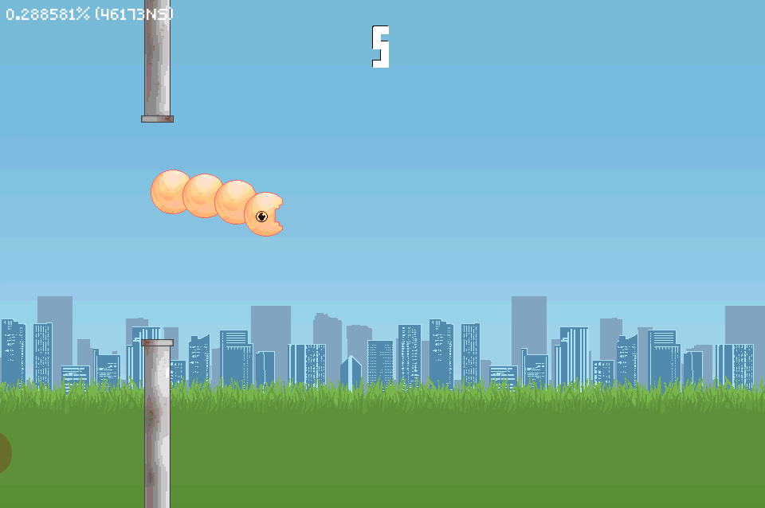

# Game Maker Language Go

[](https://github.com/silbinarywolf/gml-go/actions)
[](https://godoc.org/github.com/silbinarywolf/gml-go)
[](https://goreportcard.com/report/github.com/silbinarywolf/gml-go)

**NOTE: This project exists currently only for my personal use. There are no plans to ensure stability of any kind as of this time. Consider building your games with the well supported [Ebiten](https://github.com/hajimehoshi/ebiten) library.**

This is an engine that aims to strike a balance between capturing the simplicity of the Game Maker API whilst not losing any performance given to you by Go. It has been designed with multiplayer games in mind and differs itself from Game Maker by allowing you to "run" multiple rooms at once so that every player does not have to be in the same room.


*A screenshot of the example game, [Worm in the Pipes](tree/master/example/worm)*

## Install

```
go get github.com/silbinarywolf/gml-go
```

## Requirements

* Golang 1.13+

## Documentation

* TODO when this library has been refactored
* [Design](DESIGN.md)
* [License](LICENSE.md)

## Credits

* [Hajime Hoshi](https://github.com/hajimehoshi/ebiten) for their fantastically simple 2D game library, [Ebiten](https://github.com/hajimehoshi/ebiten).
* [Yann Le Coroller](http://www.yannlecoroller.com) for their free to use Helvetica style font.
* [magicdweedoo](http://magicdweedoo.com/) for making the soundtrack on [Worm in the Pipes](tree/master/example/worm) example game.
* [milkroscope](https://www.artstation.com/milkroscope) for their artwork [Worm in the Pipes](tree/master/example/worm) example game.
